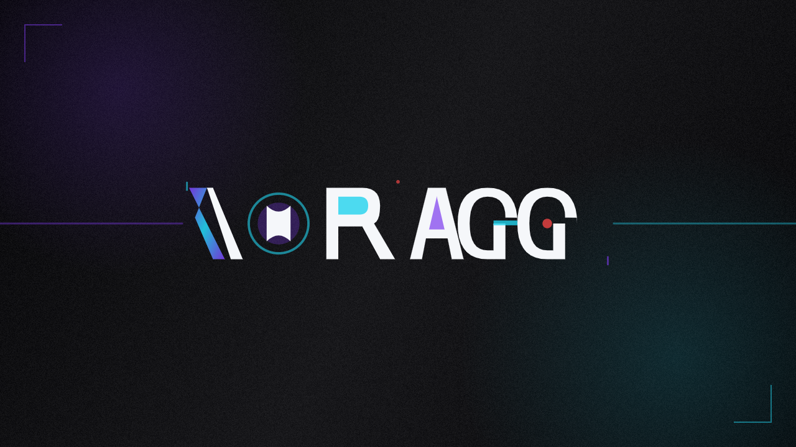

# VoraGG



Anime downloader with a web API and modern WPF desktop GUI. Download and manage anime episodes through an intuitive interface with real-time progress tracking.

## Features

- **Browse** — Enter a series URL, fetch episode list, select range, configure player/quality, and download
- **Downloads** — Real-time per-episode progress with job status, cancel support, and file management
- **Settings** — View and edit server configuration directly from the GUI
- **Logs** — Activity log with color-coded entries (errors in red, completions in green)
- **Auto-reconnect** — Automatically reconnects to the server if it goes down, resuming downloads where they left off
- **SSE progress** — Real-time Server-Sent Events for live download tracking
- **Resumable downloads** — Partial files continue from where they left off
- **Job persistence** — Download progress is saved to disk and restored on server restart

## Project structure

```
voragg/
├── server/          # REST API server (Node.js, no external dependencies)
│   └── src/
│       ├── index.js           # HTTP server + routes
│       ├── config.js           # Configuration manager
│       └── services/
│           ├── downloadJob.js  # Download job orchestration
│           ├── jobManager.js   # Job lifecycle management
│           ├── jobStore.js     # Job persistence to disk
│           └── sseManager.js   # Server-Sent Events manager
├── gui-csharp/      # WPF desktop client (.NET 10)
│   ├── MainWindow.xaml        # Main window UI
│   ├── MainWindow.xaml.cs     # Window logic and SSE handling
│   ├── ApiClient.cs           # HTTP client for server API
│   ├── Models.cs              # View models and data types
│   └── AnimeDownloader.csproj # Project file
├── src/             # Core download engine (shared with server)
│   ├── core/
│   │   ├── orchestrator.js    # Download coordination
│   │   └── downloader.js      # File downloader with range resume
│   ├── extractors/
│   │   ├── platforms/         # Site-specific extractors
│   │   └── players/           # Video player extractors
│   └── utils.js
├── assets/          # App icons and media
└── package.json
```

## Getting started

### Prerequisites

- **Node.js 18+** — for the API server
- **npm** — comes with Node.js
- **.NET 10 SDK** (or Visual Studio 2022+) — only if using the desktop GUI
- **Windows 10+** — required for the WPF GUI

### 1. Clone and install

```bash
git clone https://github.com/laza-niaina/voragg.git
cd voragg
npm install
```

### 2. Start the API server

```bash
npm run server
```

The server starts on `http://localhost:3000`.

To change the port, set the `PORT` environment variable:

```bash
# PowerShell
$env:PORT=4000; npm run server

# Linux/macOS
PORT=4000 npm run server
```

You should see:

```
voragg API server running on http://localhost:3000
```

Download progress is persisted to `server/data/jobs/` and resumes automatically after a restart.

### 3. Launch the desktop GUI

Open `gui-csharp/AnimeDownloader.csproj` in Visual Studio or your preferred C# IDE and run the project. The GUI connects to the server at `http://localhost:3000` by default.

### 4. Use the API directly (optional)

You can also interact with the server using `curl` or any HTTP client:

```bash
# Health check
curl http://localhost:3000/api/health

# List episodes for a series
curl "http://localhost:3000/api/series/episodes?url=https://voir-anime.to/series/example"

# Start a multi-episode download
curl -X POST http://localhost:3000/api/downloads \
  -H "Content-Type: application/json" \
  -d '{"episodes":[{"number":1,"url":"https://voir-anime.to/episode/1"}],"player":"streamtape"}'

# Start a single-episode download from a direct URL
curl -X POST http://localhost:3000/api/download \
  -H "Content-Type: application/json" \
  -d '{"url":"https://voir-anime.to/episode/example-ep-5","player":"streamtape","quality":"720"}'

# List all downloads
curl http://localhost:3000/api/downloads

# Check job status
curl http://localhost:3000/api/downloads/<jobId>

# Cancel a job
curl -X DELETE http://localhost:3000/api/downloads/<jobId>

# View or update config
curl http://localhost:3000/api/config
curl -X PUT http://localhost:3000/api/config -H "Content-Type: application/json" \
  -d '{"defaultMaxConcurrent":5}'
```

## API endpoints

| Method | Path                                     | Description                     |
| ------ | ---------------------------------------- | ------------------------------- |
| GET    | `/api/health`                            | Health check                    |
| GET    | `/api/series/episodes?url=<encoded-url>` | List episodes for a series      |
| POST   | `/api/downloads`                         | Start a new download job with episodes array |
| POST   | `/api/download`                          | Start a download from a single episode URL   |
| GET    | `/api/downloads`                         | List all download jobs          |
| GET    | `/api/downloads/:jobId`                  | Get job status                  |
| DELETE | `/api/downloads/:jobId`                  | Cancel a job                    |
| DELETE | `/api/downloads/:jobId/files/:episode`   | Delete a downloaded file        |
| GET    | `/api/downloads/:jobId/progress`         | SSE stream of download progress |
| GET    | `/api/config`                            | Get server configuration        |
| PUT    | `/api/config`                            | Update server configuration     |

### SSE events

The progress endpoint streams real-time events:

| Event              | Payload                                              | Description                         |
| ------------------ | ---------------------------------------------------- | ----------------------------------- |
| `episode-start`    | `{ jobId, episode, phase }`                          | Episode processing started          |
| `progress`         | `{ episode, phase, bytes, total, speed, percent }`   | Download progress update            |
| `episode-complete` | `{ jobId, episode, path }`                           | Episode finished successfully       |
| `episode-error`    | `{ jobId, episode, error }`                          | Episode failed                      |
| `episode-skip`     | `{ jobId, episode }`                                 | Episode skipped (already completed) |
| `complete`         | `{ jobId, totalEpisodes, successCount, errorCount }` | All episodes done                   |
| `cancelled`        | `{ jobId }`                                          | Job was cancelled                   |

## Supported platforms

| Platform                               | Episodes | Players             |
| -------------------------------------- | -------- | ------------------- |
| [voir-anime.to](https://voir-anime.to) | ✅       | Streamtape, Vidmoly |

## Requirements

- **Server**: Node.js 18+
- **Client**: Windows 10+, .NET 10 SDK

## License

MIT
